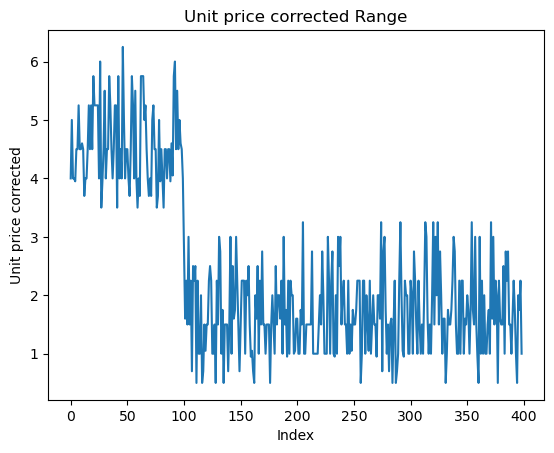

```python
# Question 1
import pandas as pd
df = pd.read_csv('./data.csv')
df.head(10)

```


<div>
<table border="1" class="dataframe">
  <thead>
    <tr style="text-align: right;">
      <th></th>
      <th>transaction_id</th>
      <th>transaction_date</th>
      <th>transaction_time</th>
      <th>sales_outlet_id</th>
      <th>staff_id</th>
      <th>customer_id</th>
      <th>instore_yn</th>
      <th>product_id</th>
      <th>quantity</th>
      <th>unit_price</th>
      <th>promo_item_yn</th>
    </tr>
  </thead>
  <tbody>
    <tr>
      <th>0</th>
      <td>7.0</td>
      <td>01/04/2019</td>
      <td>12:04:43</td>
      <td>Oulet A</td>
      <td>12.0</td>
      <td>558.0</td>
      <td>N</td>
      <td>52.0</td>
      <td>1.0</td>
      <td>2.50</td>
      <td>N</td>
    </tr>
    <tr>
      <th>1</th>
      <td>11.0</td>
      <td>01/04/2019</td>
      <td>15:54:39</td>
      <td>Oulet A</td>
      <td>17.0</td>
      <td>781.0</td>
      <td>N</td>
      <td>27.0</td>
      <td>2.0</td>
      <td>3.50</td>
      <td>N</td>
    </tr>
    <tr>
      <th>2</th>
      <td>19.0</td>
      <td>01/04/2019</td>
      <td>14:34:59</td>
      <td>Oulet A</td>
      <td>17.0</td>
      <td>788.0</td>
      <td>Y</td>
      <td>46.0</td>
      <td>2.0</td>
      <td>2.50</td>
      <td>N</td>
    </tr>
    <tr>
      <th>3</th>
      <td>32.0</td>
      <td>01/04/2019</td>
      <td>16:06:04</td>
      <td>Oulet A</td>
      <td>12.0</td>
      <td>683.0</td>
      <td>N</td>
      <td>23.0</td>
      <td>2.0</td>
      <td>2.50</td>
      <td>N</td>
    </tr>
    <tr>
      <th>4</th>
      <td>33.0</td>
      <td>01/04/2019</td>
      <td>19:18:37</td>
      <td>Oulet A</td>
      <td>17.0</td>
      <td>99.0</td>
      <td>Y</td>
      <td>34.0</td>
      <td>1.0</td>
      <td>2.45</td>
      <td>N</td>
    </tr>
    <tr>
      <th>5</th>
      <td>39.0</td>
      <td>01/04/2019</td>
      <td>18:54:46</td>
      <td>Oulet A</td>
      <td>17.0</td>
      <td>664.0</td>
      <td>Y</td>
      <td>32.0</td>
      <td>1.0</td>
      <td>3.00</td>
      <td>N</td>
    </tr>
    <tr>
      <th>6</th>
      <td>50.0</td>
      <td>01/04/2019</td>
      <td>13:03:49</td>
      <td>Oulet A</td>
      <td>12.0</td>
      <td>316.0</td>
      <td>N</td>
      <td>49.0</td>
      <td>2.0</td>
      <td>3.00</td>
      <td>N</td>
    </tr>
    <tr>
      <th>7</th>
      <td>53.0</td>
      <td>01/04/2019</td>
      <td>11:21:14</td>
      <td>Oulet A</td>
      <td>12.0</td>
      <td>38.0</td>
      <td>N</td>
      <td>60.0</td>
      <td>1.0</td>
      <td>3.75</td>
      <td>N</td>
    </tr>
    <tr>
      <th>8</th>
      <td>59.0</td>
      <td>01/04/2019</td>
      <td>19:30:55</td>
      <td>Oulet A</td>
      <td>12.0</td>
      <td>370.0</td>
      <td>Y</td>
      <td>51.0</td>
      <td>2.0</td>
      <td>3.00</td>
      <td>N</td>
    </tr>
    <tr>
      <th>9</th>
      <td>62.0</td>
      <td>01/04/2019</td>
      <td>12:01:00</td>
      <td>Oulet A</td>
      <td>12.0</td>
      <td>180.0</td>
      <td>Y</td>
      <td>49.0</td>
      <td>2.0</td>
      <td>3.00</td>
      <td>N</td>
    </tr>
  </tbody>
</table>
</div>


```python
df.tail(10)
```


<div>
<table border="1" class="dataframe">
  <thead>
    <tr style="text-align: right;">
      <th></th>
      <th>transaction_id</th>
      <th>transaction_date</th>
      <th>transaction_time</th>
      <th>sales_outlet_id</th>
      <th>staff_id</th>
      <th>customer_id</th>
      <th>instore_yn</th>
      <th>product_id</th>
      <th>quantity</th>
      <th>unit_price</th>
      <th>promo_item_yn</th>
    </tr>
  </thead>
  <tbody>
    <tr>
      <th>389</th>
      <td>1725.0</td>
      <td>01/04/2019</td>
      <td>13:58:36</td>
      <td>Outlet G</td>
      <td>12.0</td>
      <td>246.0</td>
      <td>N</td>
      <td>23.0</td>
      <td>1.0</td>
      <td>2.50</td>
      <td>N</td>
    </tr>
    <tr>
      <th>390</th>
      <td>1729.0</td>
      <td>01/04/2019</td>
      <td>15:50:25</td>
      <td>Outlet G</td>
      <td>17.0</td>
      <td>541.0</td>
      <td>N</td>
      <td>35.0</td>
      <td>1.0</td>
      <td>3.10</td>
      <td>N</td>
    </tr>
    <tr>
      <th>391</th>
      <td>1737.0</td>
      <td>01/04/2019</td>
      <td>19:00:45</td>
      <td>Outlet G</td>
      <td>12.0</td>
      <td>60.0</td>
      <td>N</td>
      <td>60.0</td>
      <td>2.0</td>
      <td>3.75</td>
      <td>N</td>
    </tr>
    <tr>
      <th>392</th>
      <td>1737.0</td>
      <td>01/04/2019</td>
      <td>19:00:45</td>
      <td>Outlet G</td>
      <td>12.0</td>
      <td>60.0</td>
      <td>N</td>
      <td>69.0</td>
      <td>1.0</td>
      <td>3.25</td>
      <td>N</td>
    </tr>
    <tr>
      <th>393</th>
      <td>1739.0</td>
      <td>01/04/2019</td>
      <td>18:32:25</td>
      <td>Outlet G</td>
      <td>17.0</td>
      <td>697.0</td>
      <td>N</td>
      <td>52.0</td>
      <td>2.0</td>
      <td>2.50</td>
      <td>N</td>
    </tr>
    <tr>
      <th>394</th>
      <td>1742.0</td>
      <td>01/04/2019</td>
      <td>18:39:29</td>
      <td>Outlet G</td>
      <td>17.0</td>
      <td>678.0</td>
      <td>N</td>
      <td>22.0</td>
      <td>1.0</td>
      <td>2.00</td>
      <td>N</td>
    </tr>
    <tr>
      <th>395</th>
      <td>1745.0</td>
      <td>01/04/2019</td>
      <td>16:58:42</td>
      <td>Outlet G</td>
      <td>17.0</td>
      <td>753.0</td>
      <td>Y</td>
      <td>58.0</td>
      <td>1.0</td>
      <td>3.50</td>
      <td>N</td>
    </tr>
    <tr>
      <th>396</th>
      <td>1745.0</td>
      <td>01/04/2019</td>
      <td>16:58:42</td>
      <td>Outlet G</td>
      <td>17.0</td>
      <td>753.0</td>
      <td>Y</td>
      <td>69.0</td>
      <td>1.0</td>
      <td>3.25</td>
      <td>N</td>
    </tr>
    <tr>
      <th>397</th>
      <td>1747.0</td>
      <td>01/04/2019</td>
      <td>11:41:37</td>
      <td>Outlet G</td>
      <td>12.0</td>
      <td>42.0</td>
      <td>Y</td>
      <td>40.0</td>
      <td>2.0</td>
      <td>3.75</td>
      <td>N</td>
    </tr>
    <tr>
      <th>398</th>
      <td>1749.0</td>
      <td>01/04/2019</td>
      <td>18:21:22</td>
      <td>Outlet G</td>
      <td>17.0</td>
      <td>117.0</td>
      <td>N</td>
      <td>46.0</td>
      <td>1.0</td>
      <td>2.50</td>
      <td>N</td>
    </tr>
  </tbody>
</table>
</div>


```python
num_rows, num_cols = df.shape
print(f"The DataFrame has {num_rows} rows and {num_cols} columns") 
```

    The DataFrame has 399 rows and 11 columns
    


```python
# Question 2
outlet_counts = df['sales_outlet_id'].value_counts()
outlet_counts.plot(kind = 'bar', title = 'Sales by Outlet', xlabel = 'Sales Outlet', ylabel = 'Count')
```


    <Axes: title={'center': 'Sales by Outlet'}, xlabel='Sales Outlet', ylabel='Count'>


    

    


```python

# find the minimum and maximum transaction_id values
min_id = df['transaction_id'].min()
max_id = df['transaction_id'].max()

print(f"The minimum transaction_id is {min_id: .2f} and the maximum transaction_id is {max_id: .2f}")

min_customer_id = df['customer_id'].min()
max_customer_id = df['customer_id'].max()
average_customer_id = df['customer_id'].mean()

print(f"The minimum customer_id is {min_customer_id: .2f}")
print(f"The maximum customer_id is {max_customer_id: .2f}")
print(f"the average customer_id is {average_customer_id: .2f}")

# count the number of occurrences of each unique value in the column
yn_counts = df['instore_yn'].value_counts()

# plot the resulting Series as a pie chart
yn_counts.plot(kind= 'pie', title = 'In-Store Sales Proportion', legend = True)
```

    The minimum transaction_id is  7.00 and the maximum transaction_id is  1749.00
    The minimum customer_id is  2.00
    The maximum customer_id is  796.00
    the average customer_id is  380.92
    


    <Axes: title={'center': 'In-Store Sales Proportion'}, ylabel='instore_yn'>


    

    


```python
#Question 3

# Create a new column called unit_price_corrected
df['unit_price_corrected'] = df['unit_price']

# Add 1.50 to unit_price for the first 100 items
df.loc[df.index < 100, 'unit_price_corrected'] += 1.50

# Subtract 1.50 from unit_price for the remaining items
df.loc[df.index >= 100, 'unit_price_corrected'] -= 1.50

# Calculate average unit prices
average_unit_price = df['unit_price'].mean()
average_unit_price_corrected = df['unit_price_corrected'].mean()

# Print the results
print(f"Average unit price: {average_unit_price:.2f}")
print(f"Average corrected unit price: {average_unit_price_corrected:.2f}")

```

    Average unit price: 3.16
    Average corrected unit price: 2.41
    


```python
# Question 4
# calculate the revenue for each transaction
df['revenue'] = df['unit_price_corrected'] * df['quantity']

# group the dataframe by sales_outlet_id and calculate the total revenue for each outlet
outlet_revenue = df.groupby('sales_outlet_id')['revenue'].sum()

# print the outlet revenue
outlet_revenue.plot(xlabel = 'Sales Outlet', ylabel = 'Total Revenue', title = 'Total Revenue by Sales Outlet', kind = 'line')
```


    <Axes: title={'center': 'Total Revenue by Sales Outlet'}, xlabel='Sales Outlet', ylabel='Total Revenue'>


    

    


```python
# Question 5
# Calculate the revenue and product units for each transaction
df['revenue'] = df['unit_price_corrected'] * df['quantity']
df['product_units'] = df['quantity']

# Group the dataframe by staff_id and calculate the total revenue and product units sold for each staff member
staff_sales = df.groupby('staff_id')[['revenue', 'product_units']].sum()

# Plot the total product units sold by staff
staff_sales.plot(kind='bar', y='product_units', xlabel='Staff ID', ylabel='Total Product Units', title='Total Product Units Sold by Staff', legend=True)

# Plot the total revenue sold by staff
staff_sales.plot(kind='bar', y='revenue', xlabel='Staff ID', ylabel='Total Revenue', title='Total Revenue Sold by Staff', legend=True)
```


    <Axes: title={'center': 'Total Revenue Sold by Staff'}, xlabel='Staff ID', ylabel='Total Revenue'>


    

    


    

    


```python
# Question 6
# Create a bar chart mapping 'quantity' with 'product_id'
outlet_quantity = df.groupby('sales_outlet_id')['quantity'].sum()
outlet_quantity.plot(xlabel = 'Sales Outlet', ylabel = 'Quantity', kind = 'bar', title= "Quantity by each outlet")
```


    <Axes: title={'center': 'Quantity by each outlet'}, xlabel='Sales Outlet', ylabel='Quantity'>


    

    


```python
# Question 7
df['unit_price_corrected'].plot(title = 'Unit price corrected Range', kind= 'line', xlabel= 'Index', ylabel ='Unit price corrected')
```


    <Axes: title={'center': 'Unit price corrected Range'}, xlabel='Index', ylabel='Unit price corrected'>


    

    


```python
# Part 2
def cafe_management_system():
    menu_items = []
    items_price = {}
    items_quantity = {}
    items_rating = {}

    # Allow the café admin to enter the menu items
    while True:
        item = input("Enter a menu item (or 'quit' to stop): ")
        if item.lower() == "quit":
            break
        menu_items.append(item)

    # Create dictionary for menu item prices
    for item in menu_items:
        price = float(input(f"Enter the price for {item}: "))
        items_price[item] = price

    # Create dictionary for menu item quantities
    for item in menu_items:
        quantity = int(input(f"Enter the quantity for {item}: "))
        items_quantity[item] = quantity

    # Create dictionary for menu item ratings
    for item in menu_items:
        rating = int(input(f"Enter the rating for {item} (1-5): "))
        items_rating[item] = rating

    # Return data structures
    return items_price, items_quantity, items_rating

# Call the function and store the returned data structures
items_price, items_quantity, items_rating = cafe_management_system()

# Create a dictionary that includes all entries
all_entries = {
    "price": items_price,
    "quantity": items_quantity,
    "rating": items_rating
}

# Create a list of items with satisfaction of 3 or higher
satisfied_items = [item for item, rating in items_rating.items() if rating >= 3]

# Create a list of items with price above 10
high_price_items = [item for item, price in items_price.items() if price > 10]

# Create a list of items with quantity less than 5
few_items = [item for item, quantity in items_quantity.items() if quantity < 5]

# Print the results
print("All Entries:", all_entries)
print("Satisfied Items:", satisfied_items)
print("High Price Items:", high_price_items)
print("Few Items:", few_items)

```

    Enter a menu item (or 'quit' to stop): capachino
    Enter a menu item (or 'quit' to stop): espresso
    Enter a menu item (or 'quit' to stop): three milk cake
    Enter a menu item (or 'quit' to stop): latte
    Enter a menu item (or 'quit' to stop): black coffee
    Enter a menu item (or 'quit' to stop): cold coffee
    Enter a menu item (or 'quit' to stop): hot coffee
    Enter a menu item (or 'quit' to stop): quit
    Enter the price for capachino: 50
    Enter the price for espresso: 8
    Enter the price for three milk cake: 9
    Enter the price for latte: 18
    Enter the price for black coffee: 5
    Enter the price for cold coffee: 9
    Enter the price for hot coffee: 4
    Enter the quantity for capachino: 2
    Enter the quantity for espresso: 40
    Enter the quantity for three milk cake: 39
    Enter the quantity for latte: 21
    Enter the quantity for black coffee: 23
    Enter the quantity for cold coffee: 43
    Enter the quantity for hot coffee: 23
    Enter the rating for capachino (1-5): 5
    Enter the rating for espresso (1-5): 4
    Enter the rating for three milk cake (1-5): 3
    Enter the rating for latte (1-5): 4
    Enter the rating for black coffee (1-5): 2
    Enter the rating for cold coffee (1-5): 3
    Enter the rating for hot coffee (1-5): 5
    All Entries: {'price': {'capachino': 50.0, 'espresso': 8.0, 'three milk cake': 9.0, 'latte': 18.0, 'black coffee': 5.0, 'cold coffee': 9.0, 'hot coffee': 4.0}, 'quantity': {'capachino': 2, 'espresso': 40, 'three milk cake': 39, 'latte': 21, 'black coffee': 23, 'cold coffee': 43, 'hot coffee': 23}, 'rating': {'capachino': 5, 'espresso': 4, 'three milk cake': 3, 'latte': 4, 'black coffee': 2, 'cold coffee': 3, 'hot coffee': 5}}
    Satisfied Items: ['capachino', 'espresso', 'three milk cake', 'latte', 'cold coffee', 'hot coffee']
    High Price Items: ['capachino', 'latte']
    Few Items: ['capachino']
    


```python

```
